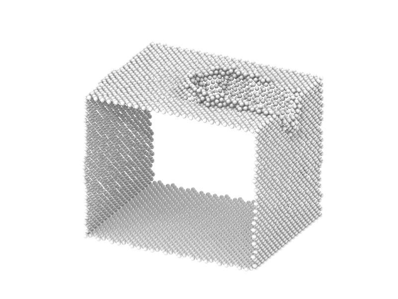
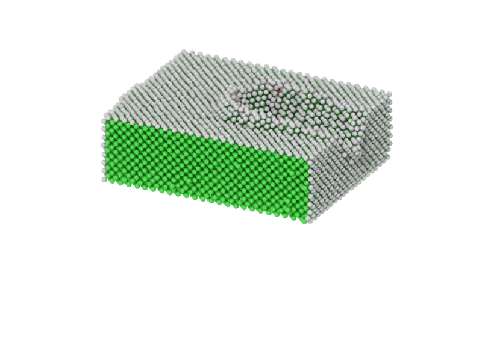
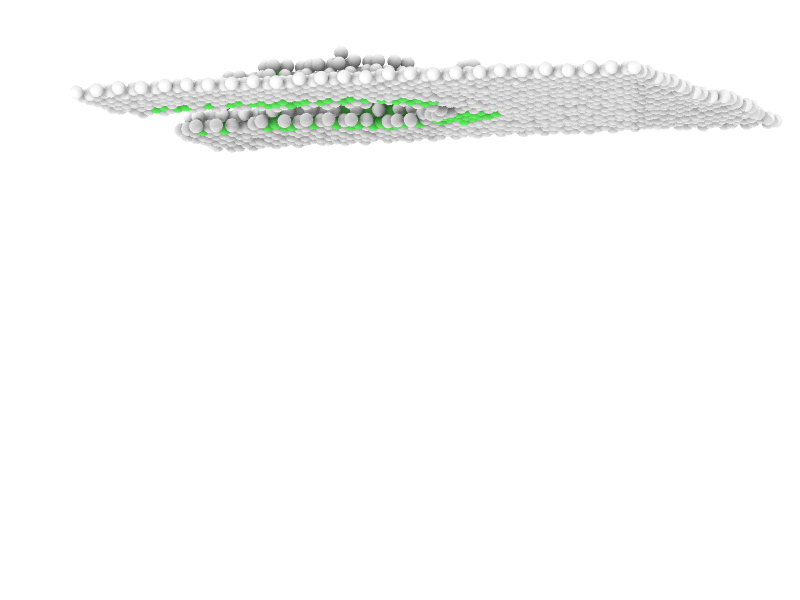

# 使用说明

​		本代码将**OVITO**中的**ViewPort**的**render_image**方法封装到了函数**export_png**里面, 将2个收费的渲染器[`TachyonRenderer`](https://www.ovito.org/docs/current/python/modules/ovito_vis.html#ovito.vis.TachyonRenderer)和[`OSPRayRenderer`](https://www.ovito.org/docs/current/python/modules/ovito_vis.html#ovito.vis.OSPRayRenderer)进行了封装, 以便于同学们更方便和免费的使用.

​		函数的输入参数意义如下所示:

```python
export_png(fileName, outputName, renderPara, 
               size=(800, 600), isCell=False, frame=0,
               backcolor=(1.0, 1.0, 1.0), rend='TR',
               cameraDir=(2, 1, -1), cameraPos=[0, 0, 0],
               modifiers=None, Fov=100
               ):
  '''
  此函数用于将文件导入到OVITO中并导出相关图片处理, 但是具有一定限制, 比如OVITO出图
  的时候可以选择在图片中添加坐标轴, color lengend和text label, 但是由于涉及QT模块的
  调用问题, 总是无法运行成功, 所以暂时不加入类似的功能.输入的各参数的物理意义如下:
  fileName  : 字符串类型, 指定原子模型文件的名称, 如果文件名称是如"deform_*.xyz", 
  那么OVITO会自动把*替换为数字,并在对应的目录下面寻找所有符合条件的文件名并将其导入.
  outputName: 字符串类型, 输出的PNG图片的名字
  renderparameter: 字典类型, 渲染器在渲染时候需要使用和调整的参数
  size      : 元组类型, 里面有2个整数, 代表输出图片的长和宽, 默认为(800, 600)
  isCell    : 逻辑类型, 是否在输出的图片里面保留simulation cell的线框, 默认为False
  frame     : 对第几帧的文件进行渲染, 默认为第0帧
  backcolor : 元组类型, 使用RGB数组指定输出图片的背景颜色, 其值应该在[0, 1], 默认为(1, 1, 1)白色
  rend      : 字符串类型, OVITO中的渲染器类型, 可以选择的类型有TR(TachyonRenderer)和
  OSPR(OSPRayRenderer), OpenGL由于使用之前需要设置环境变量, 使用较为麻烦, 而且在免费
  的OVITO中也能使用, 所以不提供相关选项
  cameraDir : 元组类型, 里面有3个数字, 代表摄像头的视线方向, 默认为(2, 1, -1)
  cameraPos : 列表类型, 里面有3个数字, 代表摄像头的位置, 默认为盒子的xyz边长的一半
  Fov       : 对应OVITO中的field of view, 可以简单理解为将图像放大到多少倍
  modifiers : 元组类型, 内部可以包含N个OVITO提供的modifier, 用户可以在主程序中通过从
  ovito中的modifier模块导入需要的分析命令, 输入必要的参数, 然后将所有的模板传入这个函数中,
  以获得更好的渲染效果, 同时也需要注意各个modifier的顺序先后问题.
  '''
```

​		在**src**的**main.py**中, 我提供了**TachyonRenderer**和**OSPRayRenderer**的的默认参数构成的字典, 其值和意义分别为:

```python
TRparameter = {
    # 启用环境遮挡阴影。启用这种照明技术可以模仿在全向漫射光照条件下出现的一些效果，例如在阴天的室外。
    'ambient_occlusion': True,
    # 控制用于环境遮蔽的天空光源的亮度。
    'ambient_occlusion_brightness': 0.8,
    # 环境遮挡是通过蒙特卡洛技术实现的。这个参数控制了计算的样本数量。
    # 更多的样本数会导致更均匀的阴影，但需要更多的计算时间。
    'ambient_occlusion_samples': 12,
    # 启用超采样以减少混叠效应。
    'antialiasing': True,
    # 为减少混叠效应，每个像素要生成的超采样射线的数量。
    'antialiasing_samples': 12,
    # 控制相机的光圈，用于景深的渲染。
    'aperture': 0.01,
    # 这个标志使景深渲染成为可能。
    'depth_of_field': False,
    # 启用平行光源，该光源以一定的角度放置在摄像机后面。
    'direct_light': True,
    # 控制定向光源的亮度。
    'direct_light_intensity': 0.9,
    # 控制相机的焦距，它用于景深渲染。
    'focal_length': 40,
    # 启用定向光源的投射阴影。
    'shadows': True
}
```

```python
OSPRparameter={
    # 控制环境光的辐射度。
    'ambient_brightness' : 0.8,
    # 启用环境光，它围绕着场景，以恒定的光芒从无限远处照亮它。
    'ambient_light_enabled' : True,
    # 如果dof_enabled设置为 "true"，光圈半径控制模糊的物体将如何出现在失焦处。
    'aperture' : 0.5,
    # 能够对渲染的图像应用去噪滤波器，以减少随机光线追踪方法（如路径追踪）所固有的蒙特卡洛噪声。
    'denoising_enabled' : True,
    # 指定默认定向光源的表观尺寸（角度，弧度）。将角度直径设置为大于0的值会产生软阴影。
    'direct_light_angular_diameter' : np.radians(10),
    # 启用默认的定向光源，该光源位于摄像机后面，大致沿观察方向指向。
    # 光源的亮度由direct_light_intensity参数控制。
    'direct_light_enabled' : True,
    # 默认定向光源的强度。该光源必须通过设置direct_light_enabled来启用。
    'direct_light_intensity' : 1,
    # 启用景深效果（焦距模糊）。启用景深渲染后，只有与摄像机的距离正好在
    # focal_length指定的范围内的物体才会显得清晰。离相机更近或更远的物体
    # 会显得模糊。这种效果的强度由光圈参数控制。
    'dof_enabled' : False,
    # 当设置Dof_enabled时，只有与相机正好在这个距离的物体才会显得清晰。离相机更近或更远的物体会显得模糊。
    'focal_length' : 40,
    # 默认材料的Specular Phong指数值。通常在2.0和10,000之间。
    'material_shininess' : 10,
    # 控制默认材质的镜面反射率。
    'material_specular_brightness' : 0.02,
    # 在光线追踪过程中，递归步骤的最大数量。通常情况下，1或2就足够了，
    # 但在渲染半透明物体时，需要更大的递归深度。
    'max_ray_recursion' : 10,
    # OSPRay渲染器支持一种叫做自适应累积的功能，这是一种渐进式的渲染方法。
    # 在每次渲染过程中，被渲染的图像会被逐渐细化。这个参数可以控制迭代的次数，直到细化停止。
    'refinement_iterations' : 4,
    # 每个像素计算的光线追踪样本的数量。较大的数值可以帮助减少混叠伪影。
    'samples_per_pixel' : 2,
    # 控制影响天空-太阳光源的地面反射率。必须先将sky_light_enabled设置为true，
    # 才能启用该光源。有效参数范围是[0.0 - 1.0]。
    'sky_albedo' : 0.3,
    # 天空-太阳光源的强度。必须首先通过设置sky_light_enabled为true来启用该光源。
    'sky_brightness' : 2,
    # 启用天空/太阳光源，模仿室外场景中来自天空和太阳的光线。
    # 天空的亮度由sky_brightness参数控制。
    'sky_light_enabled' : False,
    # 控制由于粒子影响天空-太阳光源而导致的大气浑浊。必须先通过设置sky_light_enabled
    # 来启用该光源。有效参数范围是[1.0 - 10.0]。
    'sky_turbidity' : 3
}
```

​		请同学们根据自己实际项目需求选择适合的渲染器和合适的渲染参数以进行渲染. 同时我在**main.py**中提供了3种工况下的**modifiers**的**export_png**的使用方法, 首先我们导入需要的模块并给它们取好别名:

```python
from Visuallize import export_png
from ovito.modifiers import CommonNeighborAnalysisModifier as CNA
from ovito.modifiers import SelectTypeModifier as STM
from ovito.modifiers import DeleteSelectedModifier as DSM
from ovito.modifiers import ExpressionSelectionModifier as ESM
from ovito.modifiers import PolyhedralTemplateMatchingModifier as PTM
from ovito.modifiers import DislocationAnalysisModifier as DXA
from ovito.vis import SurfaceMeshVis as SMV
import numpy as np
```

​		首先是第一种工况:

```python
# 这里我们调用CNA对模型进行计算, 然后选中所有的FCC类型的原子, 并将它们删除
template1 = (CNA(), STM(operate_on = "particles",
  property = "Structure Type", types = {CNA.Type.FCC}), 
  DSM())
```

​		调用函数**export_png**的代码:

```python
export_png(fileName='../model/friction_*.xyz',
           outputName='../picture/result_TR.png',
           renderPara=TRparameter,
           cameraDir=(2, 1, -1),
           modifiers=template1,
           frame=100, Fov=80)
```

​		渲染效果图:

​		

​		然后是第二种工况:

```python
# 第二个模板, 我们先调用PTM进行计算, 然后将所有Z坐标小于50的原子选中并且删除
template2 = (PTM(), ESM(expression='Position.Z < 50'), DSM())
```

​		调用函数的写法:

```python
export_png(fileName='../model/friction_*.xyz',
           outputName='../picture/result_OSPR.png',
           renderPara=OSPRparameter,
           cameraDir=(2, 1, -1),
           rend='OSPR',
           modifiers=template2,
           frame=100, Fov=80)
```

​		渲染效果:



​		然后是第三种工况:

```python
# 第三个模板, 我们先调用DXA进行分析, 然后将所有Z坐标小于80的原子选中并且删除
# 这里通过设置cap_transparency和surface_transparency为1可以起到隐藏defect_mesh的效果
template3 = (DXA(input_crystal_structure=DXA.Lattice.FCC,
                 defect_vis=SMV(reverse_orientation=True, cap_transparency=1, 
                                title='Defect mesh', surface_transparency=1)), 
            ESM(expression='Position.Z < 80'),
            DSM())
```

​		调用函数的写法:

```python
export_png(fileName='../model/friction_*.xyz',
           outputName='../picture/result_TR2.png',
           renderPara=TRparameter,
           cameraDir=(-0.940175, -0.316321, 0.126538),
           cameraPos=[41.2418, 45.5132, 47.5879],
           rend='TR', size=(800, 600),
           modifiers=template3,
           frame=100, Fov=51.8483)
```

​		渲染效果:



​		然后就是关于最佳镜头角度的选取问题, 同学们可以参考tutorial.pdf中的做法来选择最适合自己的角度以进行渲染.


